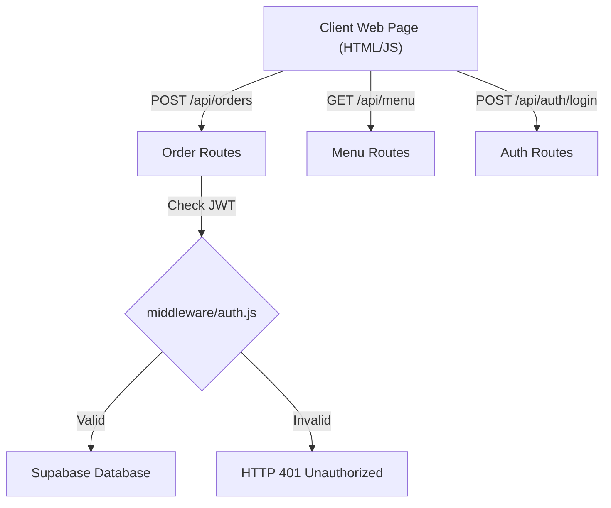

# 🥚 Vijaykumar's Mutta Bonda Shop — Complete Project & Architecture Guide

> **Comprehensive Code Identification & Architecture Guide**

---

## 📌 1. Project Overview

This project is a **Full-Stack E-Commerce & Management Web Application** built for **"Vijaykumar's Mutta Bonda Shop"** located in Coimbatore.

It consists of two main parts:
1. **Customer Web Portal (`frontend/index.html`)**:
   * View live food menu and today's special items.
   * Add items to cart and place online orders.
   * Submit customer feedback and contact inquiries.
2. **Admin Dashboard (`frontend/admin.html`)**:
   * Secure JWT login for shop owners.
   * Real-time order tracking (Accept, Prepare, Deliver).
   * Live sales statistics (Daily / Monthly Revenue).
   * Menu item CRUD editor (Price, Availability, Photos).
   * Export feedback reports as CSV files.

---

## 🏗 2. Complete File & Folder Guide ("How That Part Works")

Below is the complete reference explaining every file and folder in the codebase:

| Path / File | Type | How That Part Works (Description & Role) |
| :--- | :--- | :--- |
| **`frontend/css/style.css`** | File | Contains all visual styling, CSS variables (dark charcoal background `--charcoal-1` & ember orange highlights `--ember`), preloader animations, navigation bar, cart drawer, and admin dashboard tables. |
| **`frontend/js/main.js`** | File | Handles Customer UI logic: fetches live menu from backend API `/api/menu`, manages local cart state (add/remove/update items), submits orders to `/api/orders`, and displays toast notifications. |
| **`frontend/js/admin.js`** | File | Handles Admin Dashboard logic: authenticates admin login via `/api/auth/login`, stores JWT token in `localStorage`, loads sales stats, updates order status, edits menu items, and downloads CSV feedback exports. |
| **`frontend/index.html`** | File | Customer ordering HTML page layout including navbar, preloader, hero banner, menu grid with category filter tabs, today's special card, combos, shop gallery, customer reviews, feedback form, and cart drawer. |
| **`frontend/admin.html`** | File | Admin portal HTML page layout featuring the Login Panel widget, sales revenue stats cards, live order management table, menu editor form, and feedback report table. |
| **`frontend/vercel.json`** | File | Configuration file for Vercel static hosting service (enables clean URLs and custom trailing slash rules). |
| **`.gitignore`** | File | Specifies files and folders that Git should ignore and NEVER commit to GitHub (e.g., `node_modules/`, `.env` environment keys, log files). |
| **`DEPLOYMENT.md`** | File | Step-by-step guide explaining how to deploy the frontend to Vercel, the backend to Render, and database to Supabase for free. |
| **`image1.png`** | File | Main shop logo asset displayed in navigation header and brand marks. |
| **`PROJECT_READABLE_GUIDE.md`** | File | Main project architecture guide, data flow documentation, and file identification cheatsheet (this file). |
| **`README.md`** | File | High-level repository overview, feature breakdown, environment variable definitions, and quick start commands. |
| **`backend/`** | Folder | Contains the entire Express.js Node.js server application, database connection logic, middleware, routes, and seeding scripts. |
| **`backend/server.js`** | File | Main Express app entry point initializing global middlewares, mounting API routes (`/api/menu`, `/api/orders`, etc.), handling 404/500 errors, and starting port 5000 listener. |
| **`backend/seed.js`** | File | Database auto-seeder populating initial food menu items and creating default admin user credentials on initial startup. |
| **`backend/config/supabase.js`** | File | Database configuration connecting to Supabase cloud PostgreSQL. Includes an automatic in-memory mock fallback store for offline development. |
| **`backend/config/db.js`** | File | Optional helper script connecting to MongoDB using Mongoose if configured. |
| **`backend/middleware/auth.js`** | File | Protection middleware verifying `Bearer` JSON Web Tokens (JWT) in Authorization request headers for admin routes. |
| **`backend/routes/authRoutes.js`** | File | Handles `/api/auth/login` endpoint to authenticate credentials via `bcrypt` and return signed JWT tokens. |
| **`backend/routes/menuRoutes.js`** | File | Handles `/api/menu` CRUD endpoints (list menu, fetch today's special, add items, update price/availability, delete items). |
| **`backend/routes/orderRoutes.js`** | File | Handles `/api/orders` endpoints (customer order placement, admin order list filtering, status updates, sales analytics `/stats`). |
| **`backend/routes/feedbackRoutes.js`** | File | Handles `/api/feedback` endpoints (customer feedback form submission & admin CSV export data retrieval). |
| **`backend/routes/contactRoutes.js`** | File | Handles `/api/contact` endpoints (visitor contact form messages & admin message list). |
| **`frontend/`** | Folder | Static web application folder containing HTML pages, CSS stylesheets, client-side JS scripts, and graphic assets. |
| **`frontend/assets/`** | Folder | Directory storing static media assets like logos (`image1.png`), SVG graphics, and favicons. |
| **`frontend/css/`** | Folder | Directory containing CSS stylesheets (`style.css`). |
| **`frontend/js/`** | Folder | Directory containing client-side JavaScript scripts (`main.js` and `admin.js`). |
| **`supabase/`** | Folder | Contains SQL database migration schema scripts defining tables for `menu_items`, `orders`, `admin_users`, `feedback`, and `contact_messages`. |

---

## 📡 3. REST API Endpoints Reference



| Endpoint | Method | Access | Function |
| :--- | :--- | :--- | :--- |
| `/api/auth/login` | **POST** | Public | Admin authentication & JWT token generation. |
| `/api/menu` | **GET** | Public | Fetch food menu list (Optional: `?category=Veg`). |
| `/api/menu/special` | **GET** | Public | Fetch featured Today's Special item. |
| `/api/menu` | **POST** | Admin | Create a new menu item. |
| `/api/menu/:id` | **PUT** | Admin | Update price, availability, or photo of a menu item. |
| `/api/menu/:id` | **DELETE** | Admin | Delete a menu item from database. |
| `/api/orders` | **POST** | Public | Place a new customer food order. |
| `/api/orders` | **GET** | Admin | Retrieve all orders (`?status=Pending&search=Karthik`). |
| `/api/orders/stats` | **GET** | Admin | Get revenue & analytics summary (Daily/Monthly). |
| `/api/orders/:id/status`| **PUT** | Admin | Update order status (Pending -> Accepted -> Delivered). |
| `/api/feedback` | **POST** | Public | Submit customer visit review and feedback. |
| `/api/feedback` | **GET** | Admin | Fetch all customer feedback records for CSV export. |
| `/api/contact` | **POST** | Public | Submit contact form inquiry message. |

---

## 🚀 4. How to Run Locally

### Start Backend API Server:
```bash
cd backend
npm install
npm run dev
```
The backend API server will run at `http://localhost:5000`.

### Launch Frontend:
Open `frontend/index.html` in any web browser or use Live Server.
